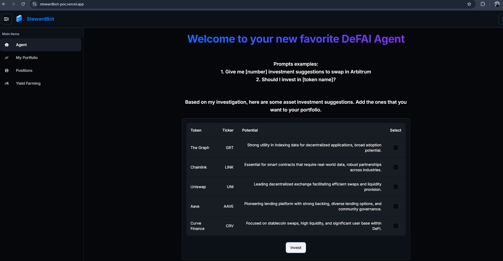
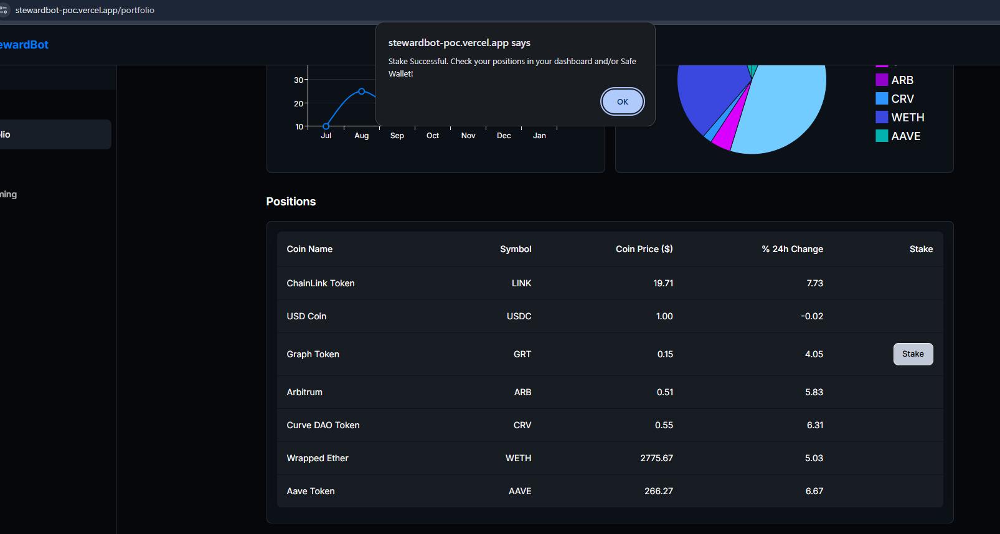

# StewardBot 🤖

StewardBot is an AI Agent that connects to OpenAI to provide suggestions to buy, sell or hold positions, swap tokens on Arbitrum using Safe Wallet and stake tokens using StakeKit. It includes an intuitive dashboard to track performance, as well as visualize and manage yield positions. It is currently a PoC, with the intention to expand to more networks, yields and strategies soon.

## Features

- AI Agent that provides investment suggestions
- One-click flow to invest in suggested assets
- Dashboard that tracks positions and assets in real time
- One-click flow to start staking assets with StakeKit's API
- All assets are assumed to be guarded in a Safe wallet





## Getting Started

### Prerequisites

This project was bootstrapped with the following technologies:

- Node.js (v22)
- npm

### Clone the Repo

```bash
git clone https://github.com/Constantino/stewardbot
cd stewardbot
```

### Run the Backend

- To install the backend dependencies, `cd` into the backend folder and run `npm i`.
- Create your `.env` file (make sure it's gitignored) with this command `cp .env.sample .env`
- Fill in with your own API Keys for each required service
- Run the backend with `npm run dev`
- Now you can call each backend service with your favorite tool by calling `https://localhost:3001/api/v1/<service-name>`

### Run the Frontend

- To install the frontend dependencies, `cd` into the frontend folder and run `npm i`.
- Create your `.env` file (make sure it's gitignored) with this command `cp .env.sample .env`
- Fill in with your own API Keys for each required service
- Run the frontend with `npm run dev`
- You can now open a browser and navigate to `localhost:3000` to interact with the frontend

And that's it you can now run your backend and frontend of StewardBot locally!

If you want to sign up to be an early user, contribute or just say hi, drop your email at https://stewardbot.xyz/.
